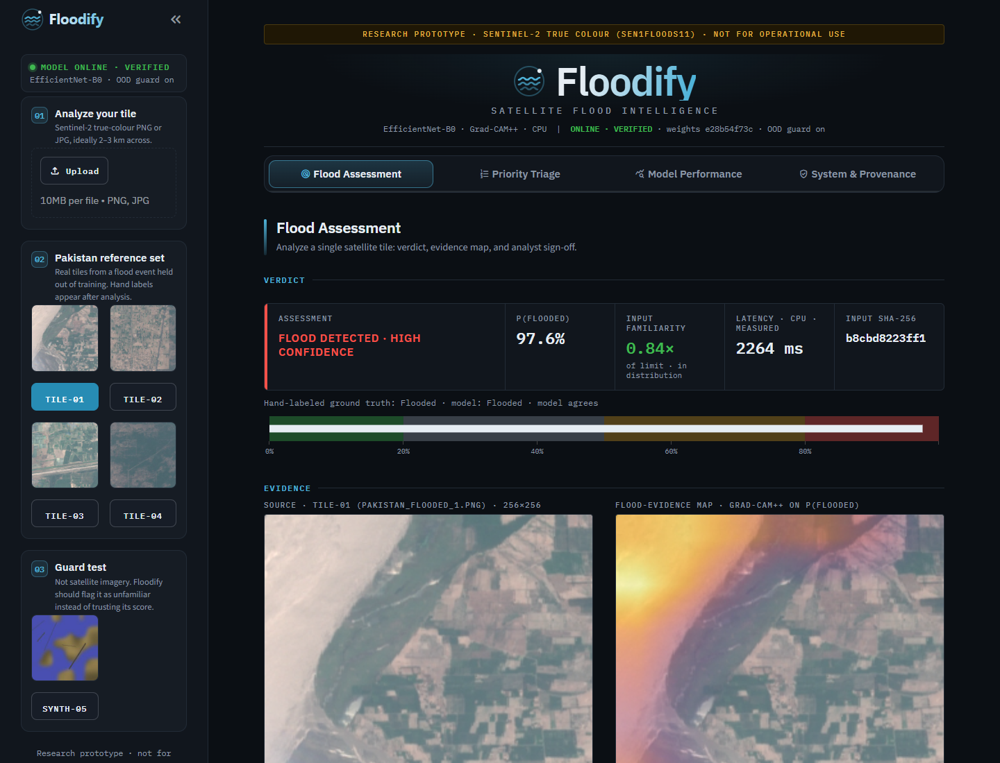
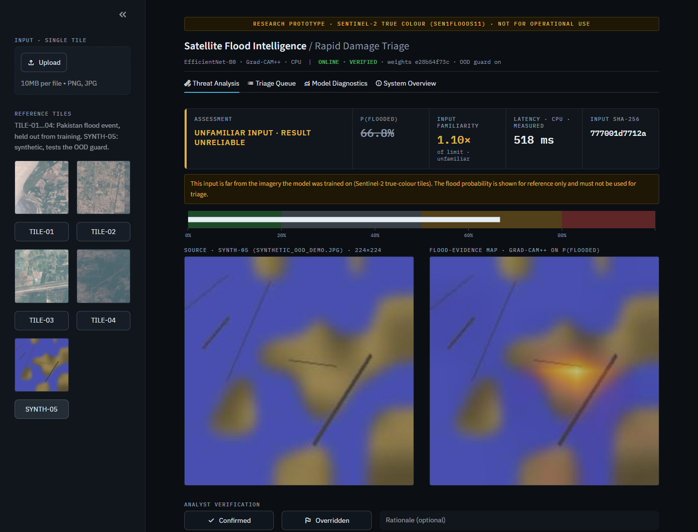
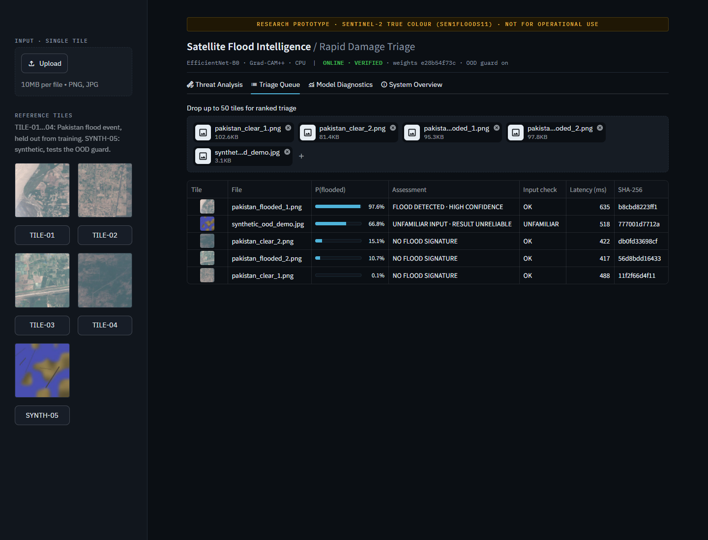
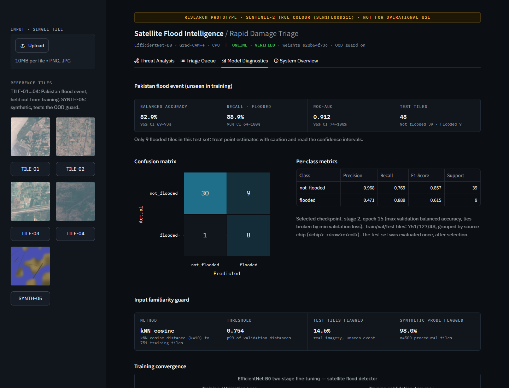

# Floodify · Satellite Flood Intelligence

[](https://floodify-pakistan.streamlit.app/)
[](https://github.com/meeasadamin/floodify/actions/workflows/ci.yml)
[](https://www.python.org/)
[](https://pytorch.org/)
[](https://streamlit.io/)
[](LICENSE)

**Floodify** is explainable flood triage for Sentinel-2 satellite imagery. An EfficientNet-B0 classifier scores each tile, Grad-CAM++ shows the spatial evidence for flooding, an input-familiarity guard refuses to vouch for imagery unlike its training data, and an analyst dashboard ranks tiles, records human verification, and exports an auditable evidence package.

**Try it live: [floodify-pakistan.streamlit.app](https://floodify-pakistan.streamlit.app/)** (the first load can take a minute if the app has been idle).

> **Research prototype, not for operational use.** Trained on 10 flood events from Sen1Floods11 and tested on an 11th, **Pakistan**, that the model never saw.



---

## Results: Pakistan flood event, unseen in training

| Metric | Value | 95% bootstrap CI |
|---|---|---|
| Balanced accuracy | **82.9%** | 69 – 93% |
| Recall · flooded | **88.9%** (8 / 9) | 64 – 100% |
| Precision · flooded | 47.1% (8 / 17) | 23 – 71% |
| ROC-AUC | **0.912** | 0.74 – 1.00 |

48 test tiles: 39 not flooded, 9 flooded. The confusion matrix is `[[30, 9], [1, 8]]`: 1 missed flood (reference tile TILE-03, shown in the dashboard) and 9 false alarms.

**How to read this.** The model catches most floods and over-flags dry tiles, which is the safer error for triage. The test set is small after cloud filtering (only 9 flooded tiles), so the intervals are wide. The numbers are honest, not flattering: selection used a separate validation split, and the test set was evaluated exactly once. All figures come from [`images/final_metrics.json`](images/final_metrics.json).

---

## Data

[Sen1Floods11](https://github.com/cloudtostreet/Sen1Floods11) v1.1 hand-labeled split: 446 Sentinel-2 chips (512×512, 10 m/px) from 11 flood events, each with a hand-drawn water mask and a JRC permanent-water mask. `prepare_sen1floods11.py` downloads it from the public bucket and builds tiles:

- Each chip is split into four 256×256 tiles and rendered as true colour (B4/B3/B2, reflectance 0 – 0.3).
- **Flood water** = hand-labeled water that is *not* permanent water, so rivers and lakes don't count as floods.
- A tile is **flooded** if ≥ 10% of valid pixels are flood water, **not flooded** if ≤ 1%. Ambiguous tiles, and tiles with < 80% valid (cloud-free) pixels, are discarded.
- **Pakistan is held out entirely.** The other 10 events form the training pool, which is split into train and validation **by source chip**, so neighbouring tiles never straddle splits.

| Split | Not flooded | Flooded |
|---|---|---|
| Train (10 events) | 544 | 207 |
| Validation (10 events) | 92 | 35 |
| Test: Pakistan | 39 | 9 |

Per-event counts and the exact rule are recorded in [`images/dataset_summary.json`](images/dataset_summary.json); the exact file lists are in [`images/split_manifest.json`](images/split_manifest.json).

---

## Model

| Component | Detail |
|---|---|
| Backbone | EfficientNet-B0, ImageNet-1K initialisation |
| Stage 1 | Backbone frozen, **including BatchNorm running statistics**; head only, 6 epochs, `lr=1e-3` |
| Stage 2 | Last MBConv stage + 1×1 head conv unfrozen, 10 epochs, `lr=1e-4` |
| Imbalance | Inverse-frequency class weights; checkpoint selected on validation **balanced** accuracy (ties → lower loss) |
| Augmentation | Square random-resized crop, horizontal + vertical flips, exact 90° rotations (no fill pixels), mild colour jitter |
| Checkpoint | 19 MB, schema v3: weights + class order + input size + normalization + OOD detector + training metadata, SHA-256 sidecar |

`flood_core.py` is the single source of truth for class order, preprocessing, architecture, and checkpoint schema. Every other file imports from it, and `load_checkpoint` refuses a checkpoint whose embedded class order, input size, normalization, or bytes don't match.

---

## Input familiarity guard

A classifier gives a confident-looking probability for *any* image. The guard compares each input's penultimate features to the 751 training tiles: the score is 1 − mean cosine similarity to the 10 nearest neighbours, and the threshold is the 99th percentile of validation scores. Flagged inputs are labeled **UNFAMILIAR INPUT · RESULT UNRELIABLE**.



The method was chosen by measurement, not assumption ([`tools/evaluate_ood_methods.py`](tools/evaluate_ood_methods.py)). Out-of-distribution inputs were synthetic tiles plus noise, flat-colour, text-document, and gradient images:

| Method | AUROC | Pakistan test flagged | Synthetic flagged | Junk flagged |
|---|---|---|---|---|
| PCA-64 Mahalanobis (first attempt, rejected) | 0.22 | 0% | 0% | 0% |
| Full 1280-d Mahalanobis | 0.83 | 0% | 3% | 25% |
| **kNN cosine, k=10 (shipped)** | **0.99** | 15% | 98% | 82% |

The Gaussian scores failed because synthetic images land *near* the training feature mean. The shipped guard also flags 15% of genuine Pakistan tiles: an unseen region really is less familiar, and the threshold was deliberately **not** tuned on the test set.

---

## Dashboard

- **Threat Analysis:** verdict-first KPI strip (assessment, P(flooded), input familiarity, measured latency, input SHA-256), risk bar, source image and Grad-CAM++ evidence map at native aspect ratio, analyst confirm/override log, evidence-package ZIP export.
- **Triage Queue:** rank up to 50 tiles by flood probability, with the familiarity check per tile.
- **Model Diagnostics:** Pakistan test metrics with confidence intervals, confusion matrix, per-class table, guard calibration, and training curves.
- **System Overview:** data rule, architecture, explainability, guard, known limitations, and live checkpoint provenance.

| Triage queue | Model diagnostics |
|---|---|
|  |  |

Grad-CAM++ is computed on the **flooded** logit, so a hotspot always means evidence *for* flooding. Overlay opacity scales with P(flooded), so clear tiles show almost no heat.

---

## Run locally

```bash
python -m venv .venv && . .venv/bin/activate      # Windows: .venv\Scripts\activate
pip install -r requirements.txt                   # CPU-only PyTorch via the index in the file
streamlit run app.py
```

## Reproduce every shipped artifact

```bash
python prepare_sen1floods11.py                    # ~1 GB download, builds data_real/ and images/dataset_summary.json
python generate_synthetic_data.py --out_dir data  # synthetic probe set for the OOD guard
python train_pipeline.py --data_dir data_real/train --test_dir data_real/test_pakistan \
    --test_name "Pakistan flood event (unseen in training)" --ood_probe_dir data \
    --epochs_stage1 6 --epochs_stage2 10         # ~15 min on a laptop CPU
python grad_cam.py --data_dir data_real/test_pakistan --out_path images/gradcam_sample.png
python tools/evaluate_ood_methods.py              # OOD method comparison table
pytest -q                                         # 27 tests
```

Training is deterministic on CPU: two independent runs produced identical metrics. Add `--device cuda` on a GPU.

## Deploy to Streamlit Community Cloud

1. Push this repository to GitHub. The 19 MB checkpoint is committed directly; no Git LFS is needed.
2. At [share.streamlit.io](https://share.streamlit.io), choose **Create app → From GitHub**, select the repo, branch `main`, main file `app.py`, and pick a distinct app URL (e.g. `floodify-pakistan`; `floodify-web` is already taken by another project).
3. Under **Advanced settings**, choose Python **3.12** or **3.13** (the dependency set is verified to resolve for both on Linux, with CPU-only PyTorch).
4. Deploy.

---

## Verification

`tests/test_consistency.py` (27 tests) checks:

- class order and identical train/serve preprocessing;
- checkpoint schema round-trip, tamper detection, class-order drift rejection, and backward compatibility;
- checkpoint tie-breaking, frozen BatchNorm statistics, fill-free augmentation, and chip-grouped splits with no leakage;
- Grad-CAM++ targeting and aspect ratio, and that serving features match training features;
- the OOD guard flagging synthetic and noise inputs;
- Streamlit interaction tests (reference tile survives reruns, corrupt uploads show an error, sidebar reopen control never hidden).

`tools/capture_screenshots.py` drives a real browser to produce the screenshots and verifies that the sidebar can be collapsed and reopened. CI runs the tests plus an end-to-end synthetic pipeline run.

## Known limitations

- **Small single-event test set.** The Pakistan hold-out has only 9 flooded tiles; confidence intervals are wide.
- **Optical RGB only.** Monsoon floods occur under cloud cover; operational systems rely on SAR. Sen1Floods11 also ships Sentinel-1 chips, which are the natural next step (new first-layer input channels and normalization).
- **Threshold-derived tile labels.** Tiles with 1 – 10% flood water are excluded from both training and evaluation.
- **Uncalibrated probabilities.** Temperature scaling on the validation split is the next step.
- **Coarse explanations.** Grad-CAM++ at a 7×7 grid; its closed-form weights assume ReLU networks, while EfficientNet uses SiLU.
- **Guard scope.** The familiarity check catches clearly different imagery; it is not a guarantee against subtle distribution shift.

## Repository structure

```
.
├── flood_core.py                # Constants, EVAL_TF, architecture, OOD detector, checkpoint schema + loader
├── prepare_sen1floods11.py      # Download Sen1Floods11, build labeled tiles, hold out Pakistan
├── train_pipeline.py            # Two-stage training, grouped splits, CIs, OOD fit, artifact export
├── grad_cam.py                  # Grad-CAM++ evidence maps + feature capture (app + CLI)
├── app.py                       # Streamlit dashboard
├── generate_synthetic_data.py   # Procedural tiles (CI smoke test + OOD probe)
├── tools/
│   ├── evaluate_ood_methods.py  # OOD method comparison
│   └── capture_screenshots.py   # Browser screenshots + sidebar regression check
├── tests/test_consistency.py
├── .github/workflows/ci.yml
├── model/                       # flood_detector.pth + .sha256
├── images/                      # metrics, dataset summary, split manifest, diagnostics
├── samples/                     # Reference tiles (Pakistan test tiles + one synthetic)
└── docs/screenshots/
```

## Citation

Bonafilia, D., Tellman, B., Anderson, T., Issenberg, E. (2020). *Sen1Floods11: a georeferenced dataset to train and test deep learning flood algorithms for Sentinel-1.* CVPR Workshops.

## Author

Developed by **Asad Amin**, AI/ML Engineer.
